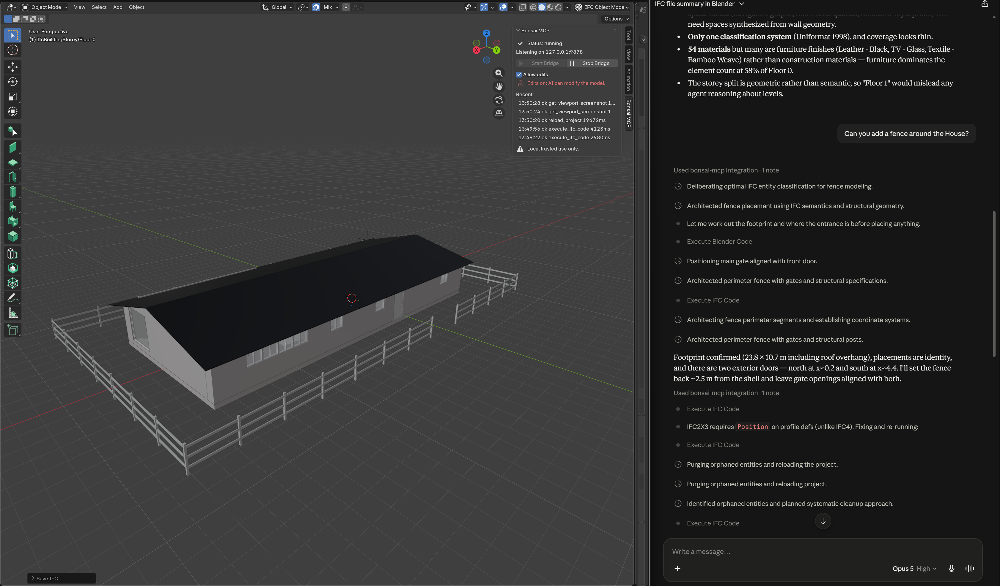

# Bonsai MCP

[](https://github.com/Show2Instruct/bonsai-mcp/actions/workflows/ci.yml)
[](LICENSE)
[](pyproject.toml)
[](https://show2instruct.github.io/bonsai-mcp/)

A local **Model Context Protocol** server that connects any MCP client
(Claude Desktop, Claude Code, Cursor, VS Code, OpenAI Codex) to a running
**Blender + Bonsai** (BlenderBIM) session. Inspect the scene, query the
loaded IFC project, capture the viewport, and run Python inside Blender.

**Documentation site: [show2instruct.github.io/bonsai-mcp](https://show2instruct.github.io/bonsai-mcp/)**

```
MCP client  --stdio-->  bonsai-mcp  --127.0.0.1:9878-->  Blender add-on (bpy + Bonsai + IfcOpenShell)
```



> Part of [**IFC-CoPilot**: A Tool-Based Framework for LLM-Driven IFC Building
> Design](https://show2instruct.github.io/ifc-copilot/).

## News

- **[2026-08]** **v1.2 released:** three new tools that sync Blender after IFC
  edits without a full reload (`refresh_view`, `refresh_geometry`,
  `reload_project`), plus IfcOpenShell `selector` queries in `list_elements`.
  [All releases](https://github.com/Show2Instruct/bonsai-mcp/releases).
- **[2026-07]** **Bonsai MCP is public,** with a
  [documentation site](https://show2instruct.github.io/bonsai-mcp/): a lighter,
  code-generation-first rewrite of our earlier
  [ifc-bonsai-mcp](https://github.com/Show2Instruct/ifc-bonsai-mcp) server.
- **[2025-11]** **MCP4IFC** paper released on
  [arXiv](https://arxiv.org/abs/2511.05533), the study that motivated this
  server.

## Relation to `ifc-bonsai-mcp`

This repository supersedes
[ifc-bonsai-mcp](https://github.com/Show2Instruct/ifc-bonsai-mcp), which we
used for the experiments in the [MCP4IFC paper](https://arxiv.org/abs/2511.05533)
and which stays online for reproducibility.

The original ships a large set of predefined tools. This one is built around
code generation. Modern LLMs write IfcOpenShell code well, so a small set of
guarded code tools covers more IFC tasks than any fixed tool list, and adapts
to tasks we never anticipated. The code-generation workflow is reworked and
simplified here, and the server is lightweight, quick to connect, and easy to
use.

**Use this repository** unless you need the original's fixed tools or the exact
paper setup. It is the one we keep updated.

## Requirements

- **Blender 3.6+** (4.x recommended).
- **Bonsai (BlenderBIM)**, only for the IFC tools. Install it from
  [bonsaibim.org](https://bonsaibim.org). 
- **uv**, one-time install below. Runs the server and handles Python 3.10+ for you.
- **git**, to clone this repo. The server runs from your local checkout;
  it is not published to PyPI.

## Setup (one-time)

Do these once. `uv` installs everything into the repo's own `.venv` the
first time you run it; nothing is installed globally, and nothing is
fetched from PyPI.

**1. Install uv:**

```bash
# macOS / Linux
curl -LsSf https://astral.sh/uv/install.sh | sh
# Windows PowerShell
powershell -ExecutionPolicy ByPass -c "irm https://astral.sh/uv/install.ps1 | iex"
```

**2. Clone this repo** somewhere permanent, and note its full path; you
point your MCP client at it below:

```bash
git clone https://github.com/Show2Instruct/bonsai-mcp.git
```

## Quick start

### 1. Install the Blender add-on

1. In Blender: **Edit > Preferences > Add-ons**. On Blender 4.2+/5.x, open
   the **▾** menu (top-right) > **Install from Disk...**; on older versions
   use the **Install...** button.
2. Pick **`blender_addon/bonsai_bridge.py`** from the repo you cloned (that
   exact file, not `scripts/package_addon.py`), or install the
   `bonsai_mcp_bridge-X.Y.Z.zip` attached to the matching
   [GitHub release](https://github.com/Show2Instruct/bonsai-mcp/releases)
   the same way. Then tick **Bonsai MCP Bridge** to enable it.
3. Open the sidebar (press **N**) > **Bonsai MCP** tab > **Start Bridge**.
   It now listens on `127.0.0.1:9878`.

### 2. Connect your client

Point your client at the folder you cloned. Everywhere below, replace
`/path/to/bonsai-mcp` with that path. On Windows in JSON, either use forward
slashes or double every backslash (`C:\\Users\\you\\bonsai-mcp`).

- **Claude Code:**

  ```bash
  claude mcp add bonsai-mcp -- uv run --directory /path/to/bonsai-mcp bonsai-mcp
  ```
- **Claude Desktop, Cursor, VS Code**, and other clients: add this to the
  client's MCP config, then restart the client:

  ```json
  {
    "mcpServers": {
      "bonsai-mcp": {
        "command": "uv",
        "args": ["run", "--directory", "/path/to/bonsai-mcp", "bonsai-mcp"]
      }
    }
  }
  ```

  On Windows, if the client can't find `uv`, use its full path as the
  `command` (e.g. `C:\\Users\\you\\.local\\bin\\uv.exe`).

`uv run` builds the project into the repo's `.venv` on first launch
(editable, so your local edits take effect on the next restart) and caches
it after that.

### 3. Verify

With Blender running and the bridge started, run this from inside the
cloned folder:

```bash
uv run bonsai-mcp doctor
```

`doctor` pings the bridge and reports Blender / IfcOpenShell status and the
tools it exposes.

Per-client config paths, the Windows `uv.exe` path note, and optional
`BONSAI_MCP_*` settings are in [`docs/clients.md`](docs/clients.md).
Example configs live in [`examples/`](./examples); set the `--directory`
path to your clone.

## Tools

Fourteen tools, each tagged `[QUERY]` (read-only) or `[EDIT]` (mutates state).

| Category | Tool                      | Purpose                                                     |
| -------- | ------------------------- | ----------------------------------------------------------- |
| QUERY    | `get_scene_info`          | Scene summary plus an optional filtered object list (paged). |
| QUERY    | `get_selected_objects`    | Per-object info for the current selection (capped).         |
| QUERY    | `list_elements`           | IFC-backed elements filtered by class (inheritance-aware), name, storey, or an IfcOpenShell `selector` query (properties, materials, attributes); paged. |
| QUERY    | `get_psets`               | IFC property and quantity sets for one or many objects (paged batches). |
| QUERY    | `get_viewport_screenshot` | Capture the viewport: `view` or `azimuth`/`elevation`, direction-aware `fit`, per-storey floor plans, shading incl. color-by-class, plus structured viewport state with depth. |
| QUERY    | `get_ifc_project_info`    | Schema, counts, materials, classifications.                 |
| QUERY    | `get_spatial_structure`   | Site -> building -> storey -> space tree with element counts. |
| QUERY    | `get_quantities`          | Quantity takeoff (areas, volumes, lengths) by class, optionally per storey. |
| EDIT     | `execute_ifc_code`        | Run IfcOpenShell / Bonsai API code. `bpy` blocked.          |
| EDIT     | `execute_blender_code`    | Run arbitrary Python with full `bpy` access.                |
| EDIT     | `refresh_view`            | Sync the scene after data-only IFC edits (names, psets); milliseconds, no disk I/O. |
| EDIT     | `refresh_geometry`        | Rebuild geometry/placement for specific elements; targeted, no disk I/O. |
| EDIT     | `reload_project`          | Full scene rebuild from the in-memory model (slow, explicit escape hatch). |
| EDIT     | `save_ifc_file`           | Write the model to disk: in place or save-as (guarded). Durability only. |

Every tool returns structured content alongside readable JSON text, and
the server also exposes MCP resources (`bonsai://project`,
`bonsai://scene`, per-element psets) and two workflow prompts
(`model-audit`, `visual-verify`).

Full reference with inputs, outputs, and examples: [`docs/tools.md`](docs/tools.md).

Example prompt, with an IFC project open in Bonsai:

> "List every wall in the model with its fire rating."

## Safety

The bridge binds to `127.0.0.1` only and has no authentication, and
`execute_blender_code` runs arbitrary Python. Treat it like an open Python
REPL on your machine and never expose it to a network. See
[`docs/safety.md`](docs/safety.md).

## Documentation

Rendered site: [show2instruct.github.io/bonsai-mcp](https://show2instruct.github.io/bonsai-mcp/)

- [Installation](docs/installation.md)
- [Client setup](docs/clients.md) (Claude, Cursor, VS Code, OpenAI)
- [Tools reference](docs/tools.md)
- [Example prompts](docs/examples.md)
- [CLI reference](docs/cli.md)
- [Safety](docs/safety.md)
- [Troubleshooting](docs/troubleshooting.md)

The changelog can be found on the
[GitHub Releases page](https://github.com/Show2Instruct/bonsai-mcp/releases).

## Contributing

See [CONTRIBUTING.md](CONTRIBUTING.md). Short version, with Python 3.10+
and `uv`:

```bash
uv venv
uv pip install -e ".[dev]"
uv run python -m ruff check src tests blender_addon scripts
uv run python -m pytest
```

Add tests and docs for behavior changes. Report security issues privately
through [GitHub Security Advisories](https://github.com/Show2Instruct/bonsai-mcp/security/advisories/new)
(see [SECURITY.md](SECURITY.md)).

## License

MIT. See [LICENSE](LICENSE).

## Disclaimer

This is not an official Bonsai release. Bonsai MCP is an independent project, not
affiliated with or endorsed by the Bonsai (BlenderBIM) project,
[bonsaibim.org](https://bonsaibim.org), or the Blender Foundation.
